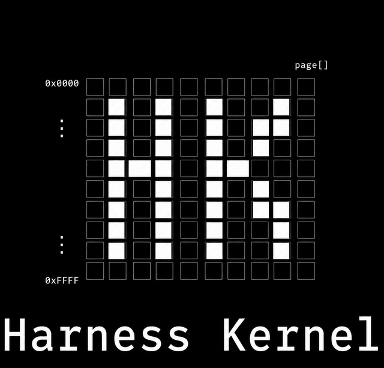

<div align="center">
  
  <h1>Harness Kernel</h1>
  <p>
    <strong>Build product agents without rebuilding the harness.</strong>
  </p>
  <p>
    A small TypeScript runtime layer for app-owned AI agents.
  </p>
  <p>
    <a href="https://ducks-software-ai-infrastructure.github.io/harness-kernel/">Docs</a>
    ·
    <a href="https://ducks-software-ai-infrastructure.github.io/harness-kernel/docs/getting-started/">Getting Started</a>
    ·
    <a href="https://ducks-software-ai-infrastructure.github.io/harness-kernel/docs/api/">API Reference</a>
    ·
    <a href="https://github.com/Ducks-Software-AI-Infrastructure/harness-kernel/releases">Releases</a>
  </p>
  <p>
    <a href="https://github.com/Ducks-Software-AI-Infrastructure/harness-kernel/actions/workflows/ci.yml">
      
    </a>
    <a href="https://github.com/Ducks-Software-AI-Infrastructure/harness-kernel/actions/workflows/pages.yml">
      
    </a>
    <a href="https://www.npmjs.com/package/@harness-kernel/core">
      
    </a>
    <a href="LICENSE">
      
    </a>
    
    
  </p>
</div>

Agent demos are easy. Product agents are mostly harness work: sessions,
transcripts, tool loops, approvals, storage, sandboxing, logs, events, streaming,
model routing, and lifecycle policy.

Harness Kernel gives TypeScript apps the small runtime layer underneath
app-owned agents. Your agent package owns behavior with modes, tools, hooks,
roles, context providers, events, and shared state. Your host application owns
model providers, storage, sandboxing, approvals, logging, services, streaming,
and session lifecycle.

The goal is to stay between two bad options: hand-rolling a custom agent harness
for every app, or adopting a framework runtime that leaks into your product
architecture.

`@harness-kernel/core` has zero external runtime dependencies. Concrete
integrations such as OpenAI, the Vercel AI SDK, filesystem storage, local shell
sandboxing, Node tools, and file logging live in optional packages.

## Why Harness Kernel

Use Harness Kernel when you want to build the agent your way without rebuilding
the infrastructure around it.

| Problem | Kernel answer |
| --- | --- |
| Agent behavior gets coupled to one host app | Agents depend on kernel contracts, not host infrastructure. |
| Runtime plumbing spreads through product code | Sessions, events, tools, approvals, storage, logs, and model routing have explicit contracts. |
| Framework defaults hide operational decisions | Providers, storage, sandboxing, approvals, logging, and services stay host-owned. |
| Demos are hard to turn into durable product agents | The same behavior package can run in a CLI, backend service, web session, or desktop app. |

## Install

Install the stable package set:

```bash
pnpm add @harness-kernel/core
pnpm add @harness-kernel/provider-openai
```

Add optional runtime modules only when the host needs them:

```bash
pnpm add @harness-kernel/storage-file
pnpm add @harness-kernel/sandbox-local
pnpm add @harness-kernel/tools-node
```

## Core Snippets

These snippets show the main boundary: build the agent behavior once, then let
each host decide how to run it.

### Runtime

The runtime composes the agent with providers and host-owned execution policy.

```ts
import { createHarnessSessionStore } from "@harness-kernel/core/runner";
import { OpenAIProvider } from "@harness-kernel/provider-openai";
import { agent } from "./agent.js";

const store = await createHarnessSessionStore({
  agent: { definition: agent },
  providers: [new OpenAIProvider()],
  defaultModel: "openai/gpt-5.1",
});

const result = await store.send("demo", "Summarize this project.");
console.log(result.answer);

await store.close();
```

### Agent

An agent packages behavior. Modes are the primary unit for prompts, tools,
context, lifecycle, and model preference.

```ts
import { defineAgent } from "@harness-kernel/core/agent";
import { HarnessMode } from "@harness-kernel/core/agent/mode";

class ChatMode extends HarnessMode {
  label = "Chat";
  prompt = "Answer clearly and ask for missing requirements.";
}

const chatMode = new ChatMode();

export const agent = defineAgent({
  key: "starter-agent",
  label: "Starter Agent",
  initialMode: chatMode,
  modes: [chatMode],
});
```

### Model

Model references are namespaced as `<provider>/<model>`. Resolution order is run
override, session override, `mode.model`, then `defaultModel`.

```ts
import { HarnessMode } from "@harness-kernel/core/agent/mode";

class DeepWorkMode extends HarnessMode {
  label = "Deep Work";
  model = "openai/gpt-5.1";
  prompt = "Think carefully and keep the answer grounded in the provided context.";
}

const session = await store.getOrCreate("demo");

session.setModel("openai/gpt-5.1-mini");
await session.send("Use the session model.");

session.clearModelOverride();
await session.send("Use a per-run model.", { model: "openai/gpt-5.1" });
```

### Tools, Events, And Roles

Tools belong to modes. Events describe meaningful runtime facts. Roles define
message semantics beyond the built-in system/user/assistant/tool roles.

```ts
import { HarnessEvent } from "@harness-kernel/core/agent/event";
import { HarnessMode } from "@harness-kernel/core/agent/mode";
import { HarnessRole, NativeRoles, RoleTargets } from "@harness-kernel/core/agent/role";
import type { AgentActionSession } from "@harness-kernel/core/agent/session";
import { HarnessTool } from "@harness-kernel/core/agent/tool";
import { s, type InferInput } from "@harness-kernel/core/schema";

type SupportState = {
  tickets: string[];
};

const ticketSchema = s.object({
  title: s.string().min(1),
});

type TicketInput = InferInput<typeof ticketSchema>;

class TicketOpenedEvent extends HarnessEvent<{ title: string }> {
  static type = "ticket.opened";
}

class CustomerRole extends HarnessRole {
  label = "Customer";
  name = "customer";
  target = RoleTargets.Messages;
  nativeRole = NativeRoles.User;
}

class OpenTicketTool extends HarnessTool<TicketInput> {
  name = "open_ticket";
  description = "Open a support ticket in shared agent state.";
  schema = ticketSchema;
  risk = "write" as const;
  requiresApproval = true;

  async execute(input: TicketInput, session: AgentActionSession<SupportState>) {
    const parsed = ticketSchema.parse(input);
    const tickets = [...session.state.get().tickets, parsed.title];

    session.state.update({ tickets });
    await session.events.emit(TicketOpenedEvent, { title: parsed.title });

    return { content: `Opened ticket: ${parsed.title}` };
  }
}

class SupportMode extends HarnessMode {
  label = "Support";
  prompt = "Help the customer and open tickets when work needs tracking.";
  tools = [new OpenTicketTool()];
}

const supportMode = new SupportMode();

export const supportAgentParts = {
  modes: [supportMode],
  roles: [new CustomerRole()],
  declaredEvents: [TicketOpenedEvent],
};
```

### Hooks

Hooks react to events. Use them for side effects such as logs, state updates,
follow-up messages, snapshots, and mode transitions.

```ts
import { defineAgent } from "@harness-kernel/core/agent";
import { HarnessHook } from "@harness-kernel/core/agent/hook";
import type { AgentActionSession } from "@harness-kernel/core/agent/session";

class TicketAuditHook extends HarnessHook.for(TicketOpenedEvent) {
  label = "Ticket audit";

  async onActive(session: AgentActionSession<SupportState>, event: TicketOpenedEvent) {
    session.log.info("ticket.opened", { title: event.payload.title });
    await session.snapshots.create({ label: `Ticket: ${event.payload.title}` });
  }
}

export const agent = defineAgent({
  key: "support-agent",
  label: "Support Agent",
  initialMode: supportMode,
  sharedState: { initial: () => ({ tickets: [] }) },
  ...supportAgentParts,
  hooks: [new TicketAuditHook()],
});
```

## Packages

| Package | Purpose |
| --- | --- |
| [`@harness-kernel/core`](https://www.npmjs.com/package/@harness-kernel/core) | Runtime contracts, sessions, schema, events, logging contracts, model provider registry, memory storage, and noop sandbox. |
| [`@harness-kernel/provider-ai-sdk`](https://www.npmjs.com/package/@harness-kernel/provider-ai-sdk) | Generic model provider wrapper for the Vercel AI SDK. |
| [`@harness-kernel/provider-openai`](https://www.npmjs.com/package/@harness-kernel/provider-openai) | OpenAI model provider built on `provider-ai-sdk`. |
| [`@harness-kernel/storage-file`](https://www.npmjs.com/package/@harness-kernel/storage-file) | File-backed run storage for transcripts, events, snapshots, metrics, and cursors. |
| [`@harness-kernel/sandbox-local`](https://www.npmjs.com/package/@harness-kernel/sandbox-local) | Local shell sandbox implementation. |
| [`@harness-kernel/tools-node`](https://www.npmjs.com/package/@harness-kernel/tools-node) | Node/local tools such as shell and file tools for modes. |
| [`@harness-kernel/logging-file`](https://www.npmjs.com/package/@harness-kernel/logging-file) | JSONL operational log sink. |
| [`@harness-kernel/create`](https://www.npmjs.com/package/@harness-kernel/create) | Scaffold/devtool for new projects. Not a runtime dependency. |

## Scaffold

```bash
pnpm create @harness-kernel
pnpm create @harness-kernel one-file my-agent
pnpm create @harness-kernel full my-agent
```

The scaffold writes starter projects with explicit `@harness-kernel/*`
dependencies. It does not install a hidden runtime wrapper.

## Development

```bash
pnpm install
pnpm lint
pnpm typecheck
pnpm test
pnpm build
pnpm verify
```

Development and docs builds require Node.js 22.12 or newer.

The documentation site lives in `apps/site` and is published at
<https://ducks-software-ai-infrastructure.github.io/harness-kernel/>.

## Contributing And Releases

- Contributing: [`CONTRIBUTING.md`](CONTRIBUTING.md)
- Code of conduct: [`CODE_OF_CONDUCT.md`](CODE_OF_CONDUCT.md)
- Security policy: [`SECURITY.md`](SECURITY.md)
- Releases: <https://github.com/Ducks-Software-AI-Infrastructure/harness-kernel/releases>

## License

Apache-2.0. See [`LICENSE`](LICENSE) and [`NOTICE`](NOTICE).
